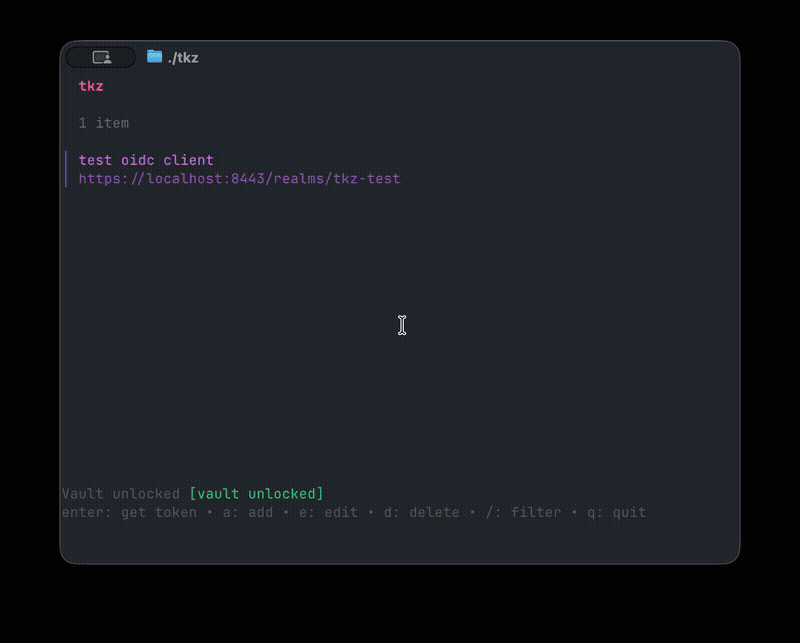

# tkz

A terminal UI for managing OAuth clients and retrieving bearer tokens.




**Stop copying client secrets from password managers and curling token endpoints manually.** Configure your OAuth clients once, get tokens with one keypress. Credentials stay in Bitwarden, never touch disk.

## Features

- **One-keypress tokens** - Select a client, press Enter, get a bearer token
- **Bitwarden integration** - Credentials fetched live from your vault, never stored locally
- **Inline vault unlock** - Prompts for your master password if the vault is locked
- **OIDC discovery** - Automatically resolves token endpoints from issuer URLs
- **Flexible field mapping** - Map any Bitwarden field to client_id or client_secret
- **Manual overrides** - Hardcode a client_id when it doesn't live in Bitwarden
- **Clipboard support** - Copy tokens or full `Authorization: Bearer` headers
- **Fuzzy search** - Filter through clients and Bitwarden items

## Prerequisites

- [Go](https://go.dev/dl/) 1.21+ (for building from source)
- [Bitwarden CLI](https://bitwarden.com/help/cli/) (`bw`) installed and logged in

```bash
# Install Bitwarden CLI
brew install bitwarden-cli

# Log in (one-time setup)
bw login
```

## Installation

### Homebrew (macOS & Linux)

```bash
brew tap Quietscher/tkz
brew install tkz
```

### From source

```bash
git clone git@github.com:Quietscher/tkz.git
cd tkz
go build -o tkz .

# Optional: move to PATH
mv tkz ~/.local/bin/
```

### Binary releases

Download pre-built binaries from [GitHub Releases](https://github.com/Quietscher/tkz/releases).

## Usage

```bash
# Just run it - tkz handles vault unlocking
tkz

# Or pre-unlock your vault
export BW_SESSION=$(bw unlock --raw)
tkz

# Flags
tkz --help
tkz --version
```

On startup, tkz checks your Bitwarden status and prompts for your master password if the vault is locked.

## Key Bindings

### Client List

| Key | Action |
|-----|--------|
| `Enter` | Get token for selected client |
| `a` | Add new client |
| `e` | Edit selected client |
| `d` / `x` | Delete selected client |
| `/` | Filter by name |
| `q` | Quit |

### Token View

| Key | Action |
|-----|--------|
| `c` | Copy access token to clipboard |
| `h` | Copy as `Authorization: Bearer <token>` header |
| `Esc` | Back to list |

### Forms

| Key | Action |
|-----|--------|
| `Tab` / `Shift+Tab` | Navigate fields |
| `Enter` | Submit |
| `Esc` | Cancel |

## Configuration

Client configurations are stored in `~/.config/tkz/clients.json` with `0600` permissions. Only *references* to Bitwarden items are stored - actual credentials are always fetched at runtime.

```json
{
  "clients": [
    {
      "name": "keycloak-dev",
      "bitwarden_item_id": "xxxxxxxx-xxxx-xxxx-xxxx-xxxxxxxxxxxx",
      "issuer": "https://auth.example.com/realms/myrealm",
      "scopes": "openid profile email"
    }
  ]
}
```

### Field Mapping

By default, tkz reads `client_id` from `login.username` and `client_secret` from `login.password` of the Bitwarden item. You can override this per client:

| Config Field | Default | Description |
|---|---|---|
| `client_id` | *(empty)* | Manual client_id override - skips Bitwarden lookup |
| `client_id_field` | `login.username` | Bitwarden field path for client_id |
| `client_secret_field` | `login.password` | Bitwarden field path for client_secret |

Supported field paths:

- `login.username` - Login username
- `login.password` - Login password
- `fields.<name>` - Custom field by name
- `notes` - Secure note content

Example with custom mapping:

```json
{
  "name": "okta-service",
  "bitwarden_item_id": "xxxxxxxx-xxxx-xxxx-xxxx-xxxxxxxxxxxx",
  "issuer": "https://dev-123456.okta.com",
  "scopes": "openid",
  "client_id": "0oa1b2c3d4e5f6g7h8",
  "client_secret_field": "fields.api_secret"
}
```

## How It Works

1. **Add a client** (`a`) - Pick a Bitwarden item from your vault, set the issuer URL and scopes
2. **Request a token** (`Enter`) - tkz fetches credentials from Bitwarden, discovers the token endpoint via OIDC, and performs a `client_credentials` grant
3. **Use the token** (`c` / `h`) - Copy the raw token or a ready-to-paste Authorization header

```
                        +------------------+
                        |  Bitwarden Vault  |
                        +--------+---------+
                                 |
                  client_id + client_secret
                                 |
+-----------+           +--------v---------+          +----------------+
|   tkz     +---------->  OIDC Discovery   +--------->  Token Endpoint |
| (your     |           | /.well-known/    |          |  POST grant    |
|  terminal)|           | openid-config    |          +-------+--------+
+-----------+           +------------------+                  |
                                                     access_token
                                                              |
                                                     +--------v--------+
                                                     |   Clipboard     |
                                                     +-----------------+
```

## Security

tkz is designed to keep credentials out of your local filesystem and process environment:

- **No secrets on disk** - Only Bitwarden item IDs are stored locally, never credentials
- **Password via stdin** - Master password is piped to `bw unlock` via `/dev/stdin`, not passed as an environment variable or command-line argument
- **HTTPS enforced** - Issuer URLs and token endpoints must use HTTPS; plain HTTP is rejected
- **TLS 1.2 minimum** - HTTP client enforces TLS 1.2+ for all OAuth connections
- **Environment cleanup** - `BW_SESSION` is removed from the process environment immediately after reading
- **File permissions** - Configuration file written with `0600` (owner read/write only)
- **Session expiry detection** - Bitwarden errors during token requests reset the unlock state, forcing re-authentication

## Dependencies

| Library | Purpose | License |
|---------|---------|---------|
| [Bubble Tea](https://github.com/charmbracelet/bubbletea) | TUI framework | MIT |
| [Bubbles](https://github.com/charmbracelet/bubbles) | TUI components (list, spinner, viewport) | MIT |
| [Lip Gloss](https://github.com/charmbracelet/lipgloss) | Terminal styling | MIT |
| [Huh](https://github.com/charmbracelet/huh) | Form components | MIT |
| [clipboard](https://github.com/atotto/clipboard) | System clipboard access | BSD-3 |

## Development

```bash
# Run tests
go test ./...

# Run tests verbose
go test ./... -v

# Build
go build -o tkz .

# Vet
go vet ./...
```

## Disclaimer

This software is provided **"as is"**, without warranty of any kind, express or implied. Use it at your own risk.

- tkz interacts with your Bitwarden vault and external OAuth endpoints. You are responsible for ensuring your vault credentials and OAuth configurations are correct and secure.
- tkz executes the Bitwarden CLI (`bw`) as a subprocess. Ensure you trust your local `bw` binary and that it has not been tampered with.
- While tkz takes measures to protect credentials in transit and in memory (HTTPS enforcement, stdin-based password passing, environment cleanup), **no software can guarantee absolute security**. Do not use tkz in environments where you cannot accept the risk of credential exposure.
- The authors are not responsible for any data loss, unauthorized access, or other damages resulting from the use of this software.
- Always review and understand the security implications before using any tool that handles authentication credentials.

## License

MIT
